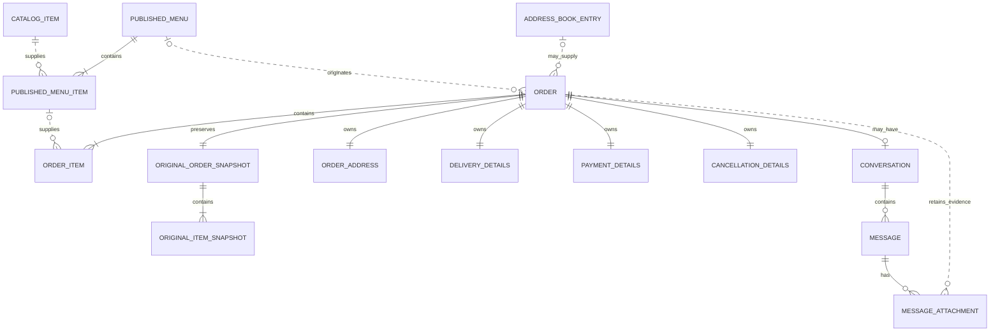

# CARENDERIA-APP — Phase 0.3

## Domain & Data Model Design

## 1. Purpose

This document translates the confirmed CARENDERIA-APP product rules into a conceptual domain and data model. It identifies entities, value objects, snapshots, derived values, configuration, ownership, mutability, and historical boundaries without defining SQL, Supabase tables, migrations, indexes, RLS, storage buckets, or application code.

## 2. Modeling Principles

- Model only concepts required by the carenderia's confirmed workflow.
- Keep the reusable catalog, published menu, and order transaction distinct.
- Preserve historical truth at publication and order-creation boundaries.
- Keep the immutable original order separate from its editable current state.
- Recalculate arithmetic from authoritative inputs rather than independently editing derived totals.
- Keep customer-facing money separate from Internal DF and rider accounting.
- Use simple state and timestamps instead of complex status workflows.
- Avoid a permanent Customer entity until customer accounts have an actual V1 purpose.
- Prefer archival/inactivation to destructive deletion when records participate in history.
- Keep printer, authentication, storage, and UI implementation outside the core transaction model.

## 3. Domain Overview

### Concept classification

| Concept                    | Classification                            | Independent entity?                 | Reason                                                                                       |
| -------------------------- | ----------------------------------------- | ----------------------------------- | -------------------------------------------------------------------------------------------- |
| Admin User                 | Entity / access boundary                  | Yes, conceptually                   | Authenticated actor that may mutate operational data; exact auth representation is deferred. |
| Catalog Item               | Entity                                    | Yes                                 | Reusable item with an independent lifecycle.                                                 |
| Published Menu             | Entity / aggregate root                   | Yes                                 | Owns one publication window and its published items.                                         |
| Published Menu Item        | Entity + publication snapshot             | Yes, owned by menu                  | Has publication-specific price, Internal DF, photo, and SOLD OUT state.                      |
| Order                      | Entity / aggregate root                   | Yes                                 | Owns the current transaction, items, metadata, and totals.                                   |
| Order Item                 | Entity + transaction snapshot             | Yes, owned by order                 | Preserves purchased item data and supports current-order editing.                            |
| Original Order Snapshot    | Immutable snapshot                        | Not a standalone business aggregate | Exists only to preserve the order's first-created state.                                     |
| Guest Identity             | Value object on order                     | No                                  | V1 needs a name/order code, not a permanent customer account.                                |
| Saved Address              | Entity                                    | Yes                                 | Admin-managed, searchable record with an independent lifecycle.                              |
| Order Address              | Immutable/current value object            | No                                  | Historical transaction address owned by the order, independent of saved address edits.       |
| Conversation               | Entity                                    | Yes                                 | Order-linked guest communication lifecycle.                                                  |
| Message                    | Entity, owned by conversation             | Yes                                 | Independently created communication with sender and timestamp.                               |
| Message Attachment         | Entity, owned by message                  | Usually yes                         | Has storage, classification, retention, and access lifecycle.                                |
| Payment Evidence           | Classified attachment / evidence role     | No separate entity initially        | A payment-evidence attachment with an explicit order association is sufficient for V1.       |
| Daily Rider Reconciliation | Entity / daily aggregate                  | Yes                                 | One daily adjustment lifecycle per Manila business date.                                     |
| Store Settings             | Configuration aggregate                   | Yes, as one logical configuration   | Small set of global store/branding preferences.                                              |
| Branding Settings          | Value object within Store Settings        | No                                  | Name, logo, and font preference belong together.                                             |
| Printer Configuration      | Optional configuration placeholder        | Not required for V1 model           | Printer model and protocol are unknown; keep out of core orders.                             |
| Receipt                    | Derived representation                    | No                                  | Rendered from current order state; printer-independent.                                      |
| Delivery Calculation       | Order-owned value object + derived values | No                                  | Inputs and results belong to the transaction being explained.                                |
| Payment Verification       | Order-owned value object                  | No                                  | Two-state metadata does not justify a payment transaction aggregate.                         |
| Cancellation Metadata      | Order-owned value object                  | No                                  | Minimal reversible bookkeeping, not a workflow entity.                                       |

### Aggregate boundaries

- **Catalog aggregate:** Catalog Item.
- **Menu aggregate:** Published Menu with Published Menu Items.
- **Order aggregate:** Order with Order Items, current delivery/payment/cancellation metadata, address snapshot, and Original Order Snapshot.
- **Conversation aggregate:** Conversation with Messages, reactions, and Message Attachments.
- **Daily reconciliation aggregate:** Daily Rider Reconciliation.
- **Configuration aggregate:** Store Settings.

These boundaries are conceptual. Physical table boundaries are deferred.

## 4. Core Relationship Map

This Mermaid ER diagram shows conceptual ownership and optional references, not a final database schema:



Not shown as forced relationships:

- Manual orders need no Published Menu, Published Menu Item, or Conversation reference.
- Daily Rider Reconciliation summarizes qualifying orders by Manila business date; it does not need to own those orders.
- Admin User is an authorization actor, not a required parent of every domain record.
- Store Settings and future Printer Configuration are global configuration, not order children.

## 5. Catalog Item

**Purpose:** Reusable source item for preparing published menus.

**Classification:** Entity and aggregate root.

**Core conceptual fields:**

- Identity
- Name
- Food price
- Category: ULAM, DESSERTS, or EXTRAS
- Photo reference
- Internal DF per unit
- Available/archived state
- Created At
- Last Edited At

**Relationships:** Can supply zero or more Published Menu Items. Historical publication references are informational; a Published Menu Item keeps its own snapshot.

**Mutability:** Name, price, category, photo, Internal DF, and catalog availability are editable for future use.

**Historical rule:** Catalog edits never propagate automatically into existing Published Menu Items or Order Items.

**Invariants:** Money values use the common money representation; category is one confirmed option; archived items cannot be selected for a new publication but remain historically referencable.

**Deletion recommendation:** Prefer archive/inactive semantics over destructive deletion once the item has participated in a publication. A never-used accidental item may be physically removable later if the physical design can prove there are no references.

## 6. Published Menu

**Purpose:** Represents one customer-facing publication window.

**Classification:** Entity and aggregate root.

**Core conceptual fields:**

- Identity
- Required menu image reference
- Created At
- Activated At
- Expires At
- Deactivated At, when ended manually
- Optional publication metadata needed by the eventual UI

**Relationships:** Owns one or more Published Menu Items; may be referenced by online Orders created from it.

**Mutability:** Before or during activation, explicit admin edits may change owned Published Menu Items. Activation/deactivation timestamps change according to business actions. Expiration is time-derived from the publication window.

**Historical rule:** Expiration or deactivation prevents new orders but does not delete the menu, its item snapshots, or existing orders.

**Invariants:**

- At most one menu is active at a time.
- An active menu has an activation time and maximum 24-hour lifetime.
- A menu is orderable only when activated, not expired, and not manually deactivated.
- A required image exists for publication.

**State recommendation:** Avoid a broad status enum. `Activated At`, `Expires At`, and `Deactivated At`, combined with the current time, can explain orderability. A small explicit active flag may be a physical convenience later, but must not conflict with timestamps.

## 7. Published Menu Item

**Purpose:** Freezes sellable item information for one Published Menu and carries publication-specific availability.

**Classification:** Entity owned by Published Menu and a publication snapshot.

**Core conceptual fields:**

- Identity within the menu
- Optional source Catalog Item identity
- Name snapshot
- Category snapshot
- Published unit price
- Internal DF per-unit snapshot
- Photo reference/snapshot
- SOLD OUT state
- Optional display position
- Created At / Last Edited At

**Relationships:** Belongs to exactly one Published Menu; may weakly reference its source Catalog Item; may be referenced by online Order Items.

**Mutability:** SOLD OUT is reversible. The admin may explicitly change publication data, including price, without changing the catalog. Such edits affect only later checkout validation and future orders.

**Historical rule:** Catalog edits never automatically change this snapshot. Orders already created never change when this item changes.

**Invariants:** A published item remains within its parent menu; its price and Internal DF are valid money values; SOLD OUT prevents new checkout but does not remove the item from the menu.

## 8. Order

**Purpose:** Records an online or manual customer transaction and its current editable operational state.

**Classification:** Entity and aggregate root.

**Core source-of-truth inputs/current fields:**

- Identity
- Stable human-readable order code
- Source: ONLINE or MANUAL
- Customer/guest name
- Current address value
- Optional source Address Book Entry identity
- Optional Published Menu identity for online orders
- Payment details
- Delivery calculation inputs
- Cancellation metadata
- Created At
- Last Edited At

**Owned children/value objects:**

- One or more current Order Items
- Current Order Address
- Current Delivery Details
- Current Payment Details
- Current Cancellation Details
- Exactly one Original Order Snapshot
- Optional order-linked Conversation

**Derived current values:** Food subtotal, Internal DF total, base charge, far-area charge, final customer delivery charge, grand total, and calculated rider contribution.

**Persisted historical/reporting values:** The current calculated monetary result should be persisted as part of a consistent transaction snapshot after each accepted edit for reliable receipts/reporting, while still being recomputable from current authoritative inputs. It must not be independently edited without changing an input.

**Mutability:** Nearly all current operational fields are admin-editable. Editing inputs triggers automatic recalculation. The order code, source, Created At, and Original Order Snapshot are immutable.

**Historical rule:** Current edits never modify the Original Order Snapshot. Catalog/menu/address-book changes never rewrite the order.

**Invariants:**

- Order code remains stable and sufficiently unique.
- An order has at least one item.
- ONLINE orders reference the authoritative Published Menu used at creation; MANUAL orders need not.
- Cancelled orders remain visible but do not count in active totals.
- Restored orders count using current values.
- Customer-facing and internal/rider amounts remain distinct.

## 9. Order Item

**Purpose:** Preserves one current transaction line independent of later catalog or menu changes.

**Classification:** Entity owned by Order and a transaction snapshot.

**Core conceptual fields:**

- Identity within the order
- Optional source Published Menu Item identity
- Optional source Catalog Item identity for traceability
- Name snapshot/current transaction name
- Category snapshot/current transaction category
- Quantity
- Unit price
- Internal DF per unit
- Derived item subtotal
- Derived Internal DF contribution

**Relationships:** Belongs to exactly one Order. An online item may weakly reference a Published Menu Item; a manual item may have no menu/catalog reference.

**Mutability:** Admin may edit name, category, quantity, unit price, Internal DF, or replace/remove/add lines in the current order. Derived values recalculate.

**Historical rule:** The Original Order Snapshot retains the first-created version. Current Order Items never read historical values dynamically from Catalog Item or Published Menu Item.

**Invariants:** Quantity is positive; item subtotal equals quantity × unit price; Internal DF contribution equals quantity × Internal DF per unit.

## 10. Original Order Snapshot Strategy

### Approach A — Dedicated immutable snapshot structure

The Order owns one immutable Original Order Snapshot containing the original header/value-object data and one or more Original Item Snapshots.

**Advantages:**

- Clear immutable boundary.
- Simple comparison between original and current state.
- Current edits cannot accidentally overwrite original values.
- Snapshot can preserve the complete transaction shape, including items and calculated results.

**Tradeoffs:**

- Intentionally duplicates transaction data once.
- Physical design must keep snapshot creation atomic with order creation.

### Approach B — Original/current pairs stored together

Each editable value carries an original and current version, such as original name/current name or original total/current total.

**Advantages:** Fewer conceptual structures for very small flat records.

**Tradeoffs:**

- Becomes awkward for added, removed, or replaced Order Items.
- Doubles many fields and scatters snapshot logic.
- Makes current queries and maintenance harder.

### Recommendation

Use **Approach A: one dedicated immutable original snapshot aggregate owned by the Order**. It is the simplest maintainable approach for a deeply editable order with child items. This is not event sourcing: there is one original snapshot and one current state, not one record per edit.

The physical design may represent the snapshot as structured records or another safe database-native form. That choice belongs to Phase 0.4; a single opaque blob should not be chosen automatically if it prevents constraints or understandable querying.

## 11. Guest/Customer Identity

**Recommendation:** Do not create a permanent Customer entity for V1.

Guest ordering is primary and customer authentication is out of initial scope. The Order owns a Guest Identity value containing the customer name and stable order code association. Contact details should only be added if later confirmed.

An optional future customer-account reference can be added to Order without replacing the order's own customer-name snapshot. Even if accounts are introduced, historical orders must retain the name/address used at transaction time.

Admin-managed Address Book Entries are not customer accounts and must not be treated as authenticated customer identity.

## 12. Address Book and Address Snapshots

### Address Book Entry

**Purpose:** Searchable, reusable admin record replacing paper addresses.

**Classification:** Entity.

**Fields:** Identity, customer name, exact address, Created At, Last Edited At, and archive state if deletion is later supported.

**Mutability:** Name and address are editable.

### Order Address

**Purpose:** Records the address actually used by a transaction.

**Classification:** Order-owned value object/snapshot.

**Fields:** Customer name where appropriate, exact address text, delivery-area classification, and optional source Address Book Entry identity.

**Historical rule:** Editing an Address Book Entry never changes an existing Order Address. Selecting an entry copies its values into the order; it does not create a live dependency.

## 13. Delivery Calculation Model

**Classification:** Order-owned value object containing authoritative inputs plus derived/persisted results.

### Inputs to preserve on the current order and original snapshot

- Delivery-area classification: one nearby area or outside promotional areas
- Item-level Internal DF per unit
- Item quantities
- Internal DF threshold applicable at creation/edit time: currently ₱20
- Fixed below-threshold base charge: currently ₱15
- Far-area charge: currently ₱20 outside the nearby areas

### Derived results

- Internal DF total
- Base customer delivery charge
- Far-area charge
- Final customer delivery charge
- Calculated rider contribution under the eventual confirmed calculation rule

### Historical recommendation

Persist both the explanatory inputs and the accepted calculated results on each order state/snapshot. This controlled duplication is justified because it makes old receipts and accounting explainable if configuration changes later. Historical values must never be recomputed from current Catalog Items or current global settings.

The authoritative formulas remain:

```text
Internal DF Total = SUM(Order Item Internal DF Per Unit × Quantity)
Base Charge = ₱0 when Internal DF Total >= ₱20, otherwise ₱15
Far-Area Charge = ₱0 nearby, otherwise ₱20
Final Customer Delivery Charge = Base Charge + Far-Area Charge
```

The exact calculated-rider formula is still a technical/business detail to finalize in the physical-design phase, but it must remain separate from customer totals.

## 14. Payment and Verification Model

**Classification:** Order-owned Payment Details value object.

**Core conceptual fields:**

- Payment method: CASH or ONLINE PAYMENT
- Verification state when method is ONLINE PAYMENT: Not Verified or Verified
- Verified At when currently/last verified according to the chosen Phase 0.4 rule
- Optional verifier reference if later judged useful

**Mutability:** Admin may change payment method as part of full editing. ONLINE PAYMENT verification is reversible.

**Rules:**

- CASH does not require online verification.
- No gateway transaction entity is needed because payment occurs externally.
- Payment evidence supports review but does not automatically change verification state.
- Changing payment method or total may require the admin to review whether existing verification remains valid; exact behavior is a remaining design decision.

**Minimal recommendation for reversal:** Keep the current state and a nullable current `Verified At`. Phase 0.4 should decide whether reversal clears that timestamp or retains a small last-verified value. Do not introduce a verification-event history unless required.

## 15. Cancellation Model

**Classification:** Order-owned Cancellation Details value object.

**Core conceptual fields:**

- Current cancelled boolean/state
- Cancelled At when currently cancelled
- Optional cancellation reason
- Optional Restored At if retaining the most recent restoration is useful

**Mutability:** Admin alone cancels or restores. Reason is optional and editable according to later UI rules.

**Rules:**

- Cancellation does not delete or overwrite the order.
- Cancelled orders remain visible and are excluded from active totals.
- Restoration re-includes the order using current recalculated values.
- Cancellation is not a general order-status machine.

**Recommendation:** Preserve `Restored At` only if it materially helps explain why a previously cancelled order is active. A full cancellation/restoration event history is not required for V1. Phase 0.4 should choose whether latest cancellation/restoration metadata is retained after restoration.

## 16. Messaging Model

### Conversation

**Purpose:** Temporary guest communication linked to one online order.

**Classification:** Entity and aggregate root.

**Fields:** Identity, Order identity, Created At, guest-access expiry derived/frozen as Order Created At + 24 hours, and optional closed/expired metadata if operationally useful.

**Rules:** One order needs at most one guest conversation for V1. Manual orders do not automatically receive one. Sending a message does not extend access.

### Message

**Classification:** Entity owned by Conversation.

**Fields:** Identity, sender role/type (guest or admin), optional text, Created At.

**Rules:** A message may contain text, attachments, or both according to later validation. Avoid threads, delivery receipts, presence, and other unconfirmed chat features.

### Reaction

For V1, a reaction is a small Message-owned child/value collection containing reaction type, actor role/identity as available, and Created At. Whether physical storage requires a separate table is deferred.

Chat availability and data retention are separate: expiry closes guest access but does not by itself delete the order or retained evidence.

## 17. Payment Evidence

**Recommendation:** Model payment evidence as a **Message Attachment with an explicit PAYMENT_EVIDENCE classification and direct order association** rather than a separate payment aggregate.

**Conceptual fields:**

- Identity
- Parent Message identity
- Associated Order identity
- Classification: ordinary image or payment evidence
- Future secure storage reference
- Original file metadata needed for validation/display
- Created At
- Retention/deletion metadata when policy is defined

**Why this is simplest:** Evidence originates through messaging but needs an order-level retention lifecycle after guest chat access expires. Classification plus direct order association supports both without duplicating the file record.

**Rules:**

- Upload does not verify payment.
- Guest chat expiry does not automatically delete payment evidence.
- Admin access must be authorized independently of guest chat access.
- Exact storage bucket, retention period, file limits, compression, and deletion policy remain deferred.

## 18. Daily Rider Reconciliation

**Purpose:** Records one daily manual reconciliation adjustment and final rider amount.

**Classification:** Entity/aggregate keyed conceptually by Manila business date.

**Core conceptual fields:**

- Business date in `Asia/Manila`
- Calculated daily rider amount
- Manual adjustment, positive, zero, or negative
- Derived final rider amount
- Last Updated At
- Optional note if Phase 0.4 confirms it

**Relationships:** Summarizes active/non-cancelled orders belonging to the business date. Orders are not owned by this aggregate.

**Mutability:** Manual adjustment and optional note are editable. Calculated and final amounts recompute when qualifying orders or the adjustment change.

**Invariants:** At most one current reconciliation per business date; final amount equals calculated amount plus adjustment; per-order manual adjustments are not required in V1.

**Persistence recommendation:** Persist the manual adjustment because it is authoritative human input. The calculated/final values may be persisted as a refreshed daily summary for reporting convenience, but remain reproducible from qualifying orders plus the adjustment.

### TOTAL ORDERS FOR TODAY read model

`TOTAL ORDERS FOR TODAY` is a query/read model over Orders plus the Daily Rider Reconciliation for one `Asia/Manila` business date.

- Today's online/manual orders come from stored Order source and Created At values interpreted in Manila time.
- The chronological list sorts by the stored creation instant.
- Search uses stored current order code, customer name, and any later-confirmed searchable fields.
- Cancelled orders remain in the result but are visibly distinguished.
- Active order count and sales/delivery/rider totals exclude currently cancelled orders.
- Customer delivery-fee total sums current accepted final customer delivery charges.
- Calculated rider total derives from current qualifying orders under the confirmed rider formula.
- Final rider amount combines that calculated total with the persisted daily manual adjustment.

The order-level source values and adjustment are stored; list composition and aggregate totals are queryable/derived. A refreshed summary may be persisted for performance, but it must never become a second independently editable source of truth.

## 19. Store/Settings Model

### Store Settings

**Classification:** Single configuration aggregate.

**Fields:** Store/carenderia name, logo reference, font-size preference, store address, nearby promotional-area definitions if later made configurable, and Last Updated At.

Branding Settings are a value object within Store Settings, not a separate entity. Avoid one row/entity per setting unless future requirements genuinely need arbitrary keys.

Delivery rule configuration may eventually need its own structured value object because thresholds and charges affect transactions. Orders must snapshot applicable values rather than depend on current settings.

### Admin User

**Classification:** Entity at the authentication/domain boundary.

Conceptually needs an identity, active access state, and link to the future authentication provider. One or very few admins are expected. Admin-only mutations include catalog/menu management, order editing/cancellation, payment verification, settings, and reconciliation.

Do not add roles, teams, permissions matrices, or customer-account relationships without requirements. Exact Supabase Auth representation is deferred.

### Printer Configuration

Keep only an optional future configuration placeholder outside core orders/settings until the printer model is known. Do not embed protocol-specific fields in Order, Receipt, or transaction entities.

## 20. Receipt/Printing Boundary

**Receipt classification:** Derived representation/value object, not an independent source-of-truth entity.

Conceptual flow:

```text
Order Current State → Receipt Representation → Printer Adapter
```

The receipt reads the current accepted order state and presents customer, items, quantities, prices, delivery charge, grand total, payment method, and order code. Printing consumes that representation.

If evidence of exactly what was printed later becomes a requirement, a small print record or receipt snapshot can be added. It is not currently required. Printer brand, protocol, pairing, and commands remain outside the core domain.

## 21. Timestamp/Timezone Model

- Store event times such as Created At, Last Edited At, Cancelled At, Verified At, Activated At, and message Created At as timezone-safe absolute instants.
- Interpret and group operational days using `Asia/Manila`.
- Represent the rider reconciliation's business date as the Manila-local calendar date it summarizes.
- Compute a menu's expiry from its activation instant while presenting local time to users.
- Compute guest chat expiry from Order Created At + 24 elapsed hours.

Do not store naive local timestamps as if they were absolute instants. Exact database timestamp types and conversion functions belong to Phase 0.4.

## 22. Money Representation

**Recommendation:** Represent money as integer centavos in the domain and physical model.

Examples:

- ₱80.00 → `8000` centavos
- ₱15.00 → `1500` centavos
- A negative daily adjustment of ₱30.00 → `-3000` centavos

**Advantages:** Exact addition/multiplication, no binary floating-point errors, simple equality/comparison, and suitable precision for Philippine peso transactions.

**Tradeoff:** Every boundary must consistently convert between displayed pesos and stored centavos. Naming and formatting must make units obvious.

A fixed-precision decimal could also be safe, but integer centavos are simpler for this V1 because confirmed prices and charges require only standard currency precision. Never use binary floating point for authoritative money.

Quantity is an integer under current requirements. Item subtotal is quantity × unit-price centavos. Rounding policy is only needed if future discounts, percentages, or fractional quantities are introduced.

## 23. Soft-Delete/Archive Strategy

| Concept                         | Recommended removal behavior                                          | Reason                                                   |
| ------------------------------- | --------------------------------------------------------------------- | -------------------------------------------------------- |
| Catalog Item                    | Archive/inactivate after use                                          | Preserve source traceability and avoid accidental reuse. |
| Published Menu                  | Deactivate/expire; do not destructively delete historical publication | Orders and publication history depend on it.             |
| Published Menu Item             | Retain with menu                                                      | Snapshot supports historical explanation.                |
| Order / Order Item              | Never ordinary destructive delete                                     | Cancellation and editing must preserve history.          |
| Original Order Snapshot         | Immutable and retained with order                                     | Core integrity requirement.                              |
| Address Book Entry              | Archive preferred if referenced; policy can be simpler if unused      | Order address is already snapshotted.                    |
| Conversation / ordinary Message | Retention policy still open                                           | Guest access expiry is not necessarily deletion.         |
| Payment Evidence                | Retain according to explicit secure policy                            | Must survive chat expiry and support verification.       |
| Store Settings                  | Update current configuration                                          | No history required unless later requested.              |

Do not add a generic soft-delete field to every concept. Use lifecycle-specific archive/deactivate/cancel/expire semantics where the business meaning differs.

## 24. Checkout Authority/Concurrency Boundary

The authoritative checkout boundary belongs on the trusted server/data side that creates the order, not in browser/cart state alone.

At final creation, one authoritative operation must:

1. Load the current Published Menu and Published Menu Items.
2. Verify activation, expiration, and manual deactivation.
3. Verify each requested item still exists in that publication and is not SOLD OUT.
4. Use current published prices and Internal DF values, not submitted browser totals.
5. Recalculate delivery inputs/results and all totals.
6. Return a conflict requiring customer review if price or availability changed.
7. Create the Order, Order Items, and Original Order Snapshot consistently only after validation succeeds.

The later physical design must provide sufficient transactional consistency so the menu cannot become invalid between validation and order creation. Exact locking, transaction, function, or RPC choices are deferred to Phase 0.4.

## 25. Snapshot Matrix

| Source                          | Snapshot target         | Fields frozen                                                                                               | Why                                                                    | May source change later?  | Does target change automatically?                   |
| ------------------------------- | ----------------------- | ----------------------------------------------------------------------------------------------------------- | ---------------------------------------------------------------------- | ------------------------- | --------------------------------------------------- |
| Catalog Item                    | Published Menu Item     | Name, category, published price, Internal DF, photo reference/source identity                               | Publication must remain stable when catalog changes.                   | Yes                       | No                                                  |
| Published Menu Item             | Order Item              | Name, category, unit price, Internal DF per unit, source identities                                         | Historical order must retain accepted transaction values.              | Yes                       | No                                                  |
| Published Menu                  | Order                   | Menu identity and relevant publication context                                                              | Explain which menu authorized an online order.                         | Yes; expires/deactivates  | No                                                  |
| Address Book Entry              | Order Address           | Name/address and delivery-area classification used                                                          | Saved-address edits must not rewrite orders.                           | Yes                       | No                                                  |
| Order current state at creation | Original Order Snapshot | Customer, address, source, items, payment, delivery inputs/results, totals, timestamps relevant at creation | Preserve original truth before admin edits.                            | Current state is editable | No; immutable                                       |
| Current editable Order          | Receipt Representation  | Current accepted values at render/print time                                                                | Produce a consistent receipt without printer coupling.                 | Yes                       | Regenerated when requested; not a historical source |
| Store/delivery configuration    | Order Delivery Details  | Thresholds/charges and location classification used, plus results                                           | Historical totals must remain explainable after configuration changes. | Yes                       | No                                                  |

Snapshot duplication is intentional only at boundaries where the source has a different lifecycle from the target.

## 26. Source-of-Truth Matrix

| Value                        | Authoritative owner before publication/order | Authoritative owner after boundary       | Notes                                                                                |
| ---------------------------- | -------------------------------------------- | ---------------------------------------- | ------------------------------------------------------------------------------------ |
| Catalog price                | Catalog Item                                 | Published Menu Item for that publication | Catalog edit does not propagate automatically.                                       |
| Published price              | Published Menu Item                          | Order Item after order creation          | Checkout uses current valid published price.                                         |
| Order item price             | Order Item current state                     | Original Snapshot retains initial value  | Admin edits current input; subtotal recalculates.                                    |
| Catalog Internal DF          | Catalog Item                                 | Published Menu Item snapshot             | Item-specific configuration.                                                         |
| Order Internal DF            | Order Item current state                     | Original Snapshot retains initial value  | Current delivery totals derive from current order items.                             |
| Customer address             | Checkout/manual input or Address Book Entry  | Order Address                            | Address Book remains reusable, not authoritative for history.                        |
| Delivery-area classification | Order Delivery Details                       | Original Snapshot retains initial value  | Drives far-area charge.                                                              |
| Customer delivery charge     | Order Delivery Details derived result        | Original Snapshot retains initial result | Recalculate from inputs; do not freely edit result alone.                            |
| Order grand total            | Order derived/current persisted result       | Original Snapshot retains initial result | Recalculate from current items and delivery.                                         |
| Payment method               | Order Payment Details                        | Original Snapshot retains initial method | CASH or ONLINE PAYMENT.                                                              |
| Payment verification         | Current Order Payment Details                | Same current metadata                    | Admin-owned, reversible; evidence is supporting data.                                |
| Cancellation state           | Current Order Cancellation Details           | Same current metadata                    | Admin-owned; not a status pipeline.                                                  |
| Rider manual adjustment      | Daily Rider Reconciliation                   | Same daily aggregate                     | Never encoded by changing orders.                                                    |
| Store name/logo/font size    | Store Settings                               | Current configuration                    | Orders need not snapshot branding unless later receipts require historical branding. |
| Guest chat expiry            | Order Created At / Conversation              | Frozen expiry instant                    | Message activity does not extend it.                                                 |

## 27. Derived vs Persisted Values

| Value                          | Derivation                                                  | Recommendation                                                                    |
| ------------------------------ | ----------------------------------------------------------- | --------------------------------------------------------------------------------- |
| Item subtotal                  | Quantity × unit price                                       | Derive automatically; persist with accepted order state/snapshot for consistency. |
| Item Internal DF contribution  | Quantity × Internal DF per unit                             | Derive automatically; snapshot result for explanation if useful.                  |
| Food subtotal                  | Sum of current item subtotals                               | Derive and persist current accepted result.                                       |
| Internal DF total              | Sum of item Internal DF contributions                       | Derive and persist current accepted result.                                       |
| Base charge                    | Threshold rule applied to Internal DF total                 | Derive and snapshot inputs/result.                                                |
| Far-area charge                | Delivery-area classification rule                           | Derive and snapshot classification/result.                                        |
| Final customer delivery charge | Base charge + far-area charge                               | Derive and persist; never independently edit without an explicit override rule.   |
| Grand total                    | Food subtotal + final customer delivery charge              | Derive and persist current accepted result.                                       |
| Calculated rider amount        | Confirmed rider formula over active orders                  | Derive; formula still needs final physical-design clarification.                  |
| Daily calculated rider total   | Sum of qualifying active orders for Manila date             | Query/derive; may cache/persist a refreshed summary.                              |
| Daily manual adjustment        | Admin input                                                 | Persist as authoritative input.                                                   |
| Daily final rider amount       | Calculated total + adjustment                               | Derive; may persist refreshed summary.                                            |
| Guest chat expiry              | Order Created At + 24 hours                                 | Compute once and persist/freeze for clear access checks.                          |
| Menu active/orderable          | Activation/deactivation/expiry timestamps + current instant | Derive; avoid contradictory independent status.                                   |

Persisted derived values are denormalized transaction results, not independent sources of truth. They must be written/recalculated together with the inputs that produced them.

## 28. Manual-Order Differences

Manual and online orders share the Order aggregate, Order Items, current/original snapshot strategy, cancellation, editing, totals, payment method, and daily reporting.

Manual orders differ as follows:

- No Published Menu relationship is required.
- No Published Menu Item relationship is required for Order Items.
- Item names, prices, Internal DF, and categories may be entered directly by the admin.
- No guest Conversation or guest-access expiry is required by default.
- Payment evidence may need an admin-side attachment path if a manual ONLINE PAYMENT order has no guest chat; this remains open.
- Checkout menu revalidation does not apply, but server-side validation and automatic arithmetic still do.

Do not make the common order model require online-only references.

## 29. Risks and Tradeoffs

- **Over-snapshotting:** Copying every source field adds noise. Snapshot only transaction/publication facts needed for display, calculation, traceability, and history.
- **Under-snapshotting:** Reading old orders from current catalog/menu values destroys historical truth.
- **Original/current divergence:** Admin UI and receipts must clearly use current state while retaining original state for inspection.
- **Opaque snapshot storage:** A single unstructured blob is simple initially but can weaken constraints and future inspection.
- **Stale browser values:** Browser-submitted prices and totals are untrusted; authoritative checkout must recalculate.
- **Floating-point money:** Can introduce rounding errors into totals and reconciliation; use integer centavos.
- **Destructive deletion:** Can orphan or erase history; use lifecycle-specific archival semantics.
- **Mixed accounting:** Rider amounts must not be folded into food prices or customer totals.
- **Chat/evidence coupling:** Guest access expiry must not delete retained payment evidence.
- **Manual-order coupling:** Manual orders must not require menu or guest-chat records.
- **Premature Customer entity:** Creates account/identity complexity without a V1 benefit.
- **Derived-value drift:** Persisted totals can disagree with inputs unless recalculation is centralized and atomic.
- **Timezone mistakes:** Filtering by UTC date instead of Manila business date produces incorrect daily reports.
- **Concurrency:** Availability or prices may change during checkout; validation and creation need a trusted transactional boundary.

## 30. Recommended Conceptual Model

Use the following lean model:

### Independent entities/aggregates

- Admin User
- Catalog Item
- Published Menu with Published Menu Items
- Order with current Order Items and owned transaction details
- Address Book Entry
- Conversation with Messages and Attachments
- Daily Rider Reconciliation
- Store Settings

### Order-owned value objects/snapshots

- Guest Identity
- Order Address
- Delivery Details
- Payment Details
- Cancellation Details
- Immutable Original Order Snapshot with Original Item Snapshots

### Derived representations

- Receipt Representation
- Today's Orders query/read model
- Daily totals
- Menu orderability

### Deliberately excluded from V1 core

- Permanent Customer entity/account
- Payment-gateway transaction aggregate
- Multi-step order-status workflow
- Full event sourcing/edit history
- Per-order rider reconciliation entity
- Printer-protocol fields on orders
- Generic arbitrary settings framework

This model preserves the necessary historical duplication while keeping operational aggregates small and explicit.

## 31. Remaining Technical Decisions

Phase 0.4 should decide:

1. Physical tables, columns, keys, constraints, and cardinalities.
2. Physical representation of Original Order Snapshot and Original Item Snapshots.
3. Transaction strategy for checkout validation plus atomic order/snapshot creation.
4. Final calculated-rider formula and any adjustment note/authorization metadata.
5. Cancellation/restoration timestamp retention after restoration.
6. `Verified At` behavior when verification is reversed.
7. Order-code generation, uniqueness constraint, and recovery behavior.
8. Exact timestamp types and Manila-day query strategy.
9. Whether/which derived totals are persisted, generated, or refreshed.
10. Currency validation, bounds, and naming conventions for centavo fields.
11. Supabase Auth mapping and admin authorization/RLS.
12. Storage references, access rules, retention, deletion, file limits, and compression for images/evidence.
13. Ordinary message retention after guest access expiry.
14. Indexes needed for active menu, order code, Manila daily queries, search, and chronological lists.
15. Archive/deletion constraints and referential behavior.
16. Manual ONLINE PAYMENT evidence submission without guest chat.
17. Whether Message Reactions require their own physical table.
18. Whether a print record is needed after the printer workflow is known.

UI conflict presentation, printer protocol, offline strategy, and detailed branding controls remain later-phase concerns rather than schema blockers.

## 32. Readiness for Next Phase

The conceptual model is sufficiently stable to begin **Phase 0.4 — Supabase Physical Schema & Security Design**.

The core entities, ownership boundaries, historical snapshots, mutable/current state, money strategy, timezone interpretation, archival philosophy, and checkout authority boundary are now explicit. Remaining choices are physical representation and security decisions appropriate for Phase 0.4.

Phase 0.4 should design tables, columns, constraints, relationships, authentication mapping, RLS, storage policy, indexes, and transactional operations in a separate task. No physical schema or implementation is created by this document.
