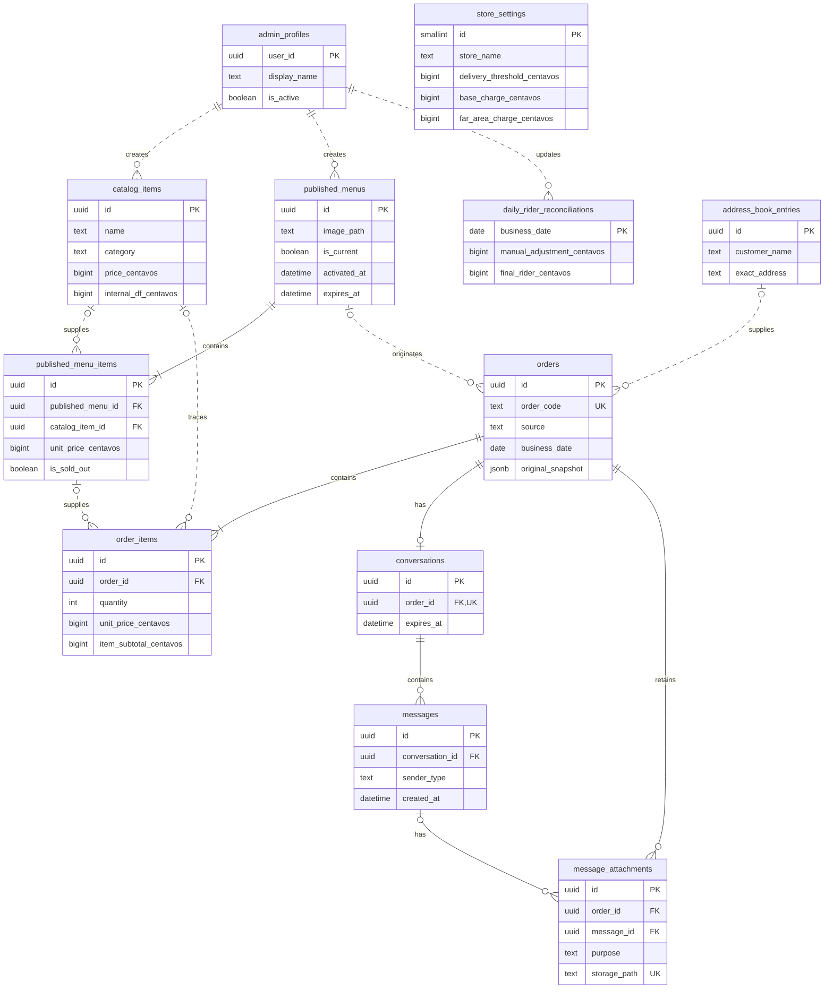

# CARENDERIA-APP — Phase 0.4

## Supabase Physical Schema & Security Design

## 1. Purpose

This document translates the Phase 0.3 conceptual model into a proposed Supabase/PostgreSQL physical schema and security architecture. It specifies proposed tables, columns, constraints, relationships, indexes, RLS boundaries, Storage boundaries, and trusted transaction operations without creating or executing SQL, migrations, policies, buckets, functions, or application code.

## 2. Design Principles

- Preserve catalog → publication → order snapshot boundaries.
- Keep the current editable order separate from its immutable original snapshot.
- Use integer centavos for all money and `timestamptz` for absolute event times.
- Keep `Asia/Manila` business-day reporting explicit.
- Expose only genuinely public menu data to anonymous users.
- Route guest-private and transaction-writing operations through narrow trusted boundaries.
- Use RLS plus least-privilege grants on every exposed table; policies do not replace grants.
- Keep service/secret credentials out of browsers.
- Keep payment evidence private and access-controlled.
- Prefer explicit columns and checks over generic key/value or JSON designs, except where JSONB solves the concrete immutable-snapshot requirement.
- Avoid tenant abstractions, customer accounts, inventory quantities, generalized promotions, event sourcing, and restaurant status pipelines.

Reference basis: [Supabase RLS](https://supabase.com/docs/guides/database/postgres/row-level-security), [Supabase database functions](https://supabase.com/docs/guides/database/functions), [Supabase Storage access control](https://supabase.com/docs/guides/storage/security/access-control), [Supabase bucket access models](https://supabase.com/docs/guides/storage/buckets/fundamentals), [PostgreSQL numeric types](https://www.postgresql.org/docs/current/datatype-numeric.html), [PostgreSQL date/time types](https://www.postgresql.org/docs/current/datatype-datetime.html), [PostgreSQL constraints](https://www.postgresql.org/docs/current/ddl-constraints.html), and [PostgreSQL partial indexes](https://www.postgresql.org/docs/current/indexes-partial.html).

## 3. Physical Schema Overview

### Proposed tables

| Table                         | Purpose                                                                            | Exposure                                                             |
| ----------------------------- | ---------------------------------------------------------------------------------- | -------------------------------------------------------------------- |
| `admin_profiles`              | Maps Supabase Auth users to active application admins.                             | Admin-private                                                        |
| `catalog_items`               | Reusable food catalog.                                                             | Admin-private                                                        |
| `published_menus`             | Publication windows and menu image.                                                | Active rows customer-readable; history admin-private                 |
| `published_menu_items`        | Publication snapshots and SOLD OUT state.                                          | Active-menu rows customer-readable; history admin-private            |
| `orders`                      | Current editable online/manual transaction plus immutable original JSONB snapshot. | Guest-private through trusted operations; admin-private table        |
| `order_items`                 | Current editable order lines.                                                      | Guest-private through trusted receipt operation; admin-private table |
| `address_book_entries`        | Searchable admin address records.                                                  | Admin-private                                                        |
| `conversations`               | One optional guest conversation per online order.                                  | Guest-private through trusted operations; admin-private table        |
| `messages`                    | Minimal guest/admin message records and simple reactions.                          | Guest-private through trusted operations; admin-private table        |
| `message_attachments`         | Storage metadata for message images and payment evidence.                          | Private/sensitive                                                    |
| `daily_rider_reconciliations` | Manila-business-date rider adjustment and summary.                                 | Admin-private                                                        |
| `store_settings`              | Singleton explicit store, branding, and delivery configuration.                    | Sanitized subset customer-readable; mutations admin-only             |

### Deliberate omissions

- No permanent customer table or customer-auth schema in V1.
- No original-snapshot child tables; one immutable versioned JSONB snapshot is recommended.
- No payment gateway transaction table.
- No message-reactions table in V1.
- No print/receipt table until printed-copy history is required.
- No generic roles, permissions, tenant, promotion, inventory, or workflow tables.

All proposed IDs use `uuid`. UUID defaults can use the platform-supported random UUID facility during implementation. Exact default expressions belong in migrations.

## 4. Proposed ER Diagram

Proposed physical design only; nothing in this diagram has been implemented:

`store_settings` is intentionally standalone because no historical order depends on its current row; applicable values are copied to orders. Nullable creator/updater references are shown conceptually and do not make operational records dependent on retaining an admin profile.

## 5. Money Representation

Use PostgreSQL `bigint` for every authoritative money value, measured in centavos, with an `_centavos` suffix.

- ₱80.00 is `8000`.
- ₱15.00 is `1500`.
- Daily manual rider adjustment may be negative; other confirmed money inputs/results are non-negative.
- `bigint` gives a very large safe range while keeping exact integer arithmetic. It is uniform across item, order, and daily totals.
- Binary floating-point types are prohibited for authoritative money.

Checks should enforce `>= 0` for prices, Internal DF, charges, subtotals, totals, and calculated rider values. `manual_adjustment_centavos` is intentionally signed. Upper business limits can be added later if abuse prevention requires them; avoid arbitrary low caps now.

Derived money columns are persisted for reporting and historical clarity but may only be written by trusted calculation paths together with their source inputs.

## 6. Timestamp/Timezone Strategy

Use PostgreSQL `timestamptz` for absolute event timestamps:

- `created_at`, `updated_at`, `activated_at`, `expires_at`, `deactivated_at`
- `last_edited_at`, `last_cancelled_at`, `restored_at`, `verified_at`
- conversation/message/attachment times

Use PostgreSQL `date` for `business_date` on orders and daily rider reconciliations. For orders, set `business_date` from `created_at` interpreted in `Asia/Manila` inside the trusted creation transaction. It is stored to make daily reporting/indexing explicit and stable. It must not be accepted from a guest browser.

Absolute timestamps remain authoritative. Human display and daily grouping use `Asia/Manila`. Do not use naive `timestamp without time zone` for events. PostgreSQL stores `timestamptz` instants internally in UTC and can render them in a selected zone.

Menu expiry and guest-chat expiry are absolute instants. Guest expiry is fixed from order creation and is not extended by messages.

## 7. Enum/Check-Constraint Strategy

Recommend `text` columns plus `CHECK` constraints instead of PostgreSQL ENUM types for V1.

| Concept                    | Allowed values                               |
| -------------------------- | -------------------------------------------- |
| Catalog/category snapshots | `ULAM`, `DESSERTS`, `EXTRAS`                 |
| Order source               | `ONLINE`, `MANUAL`                           |
| Payment method             | `CASH`, `ONLINE_PAYMENT`                     |
| Payment verification       | `NOT_VERIFIED`, `VERIFIED`, or null for CASH |
| Delivery location class    | `NEARBY`, `OUTSIDE`                          |
| Message sender             | `GUEST`, `ADMIN`                             |
| Attachment purpose         | `MESSAGE_IMAGE`, `PAYMENT_EVIDENCE`          |

Text plus checks is easy to read and change in migrations. PostgreSQL ENUMs offer strong typing but are less convenient to evolve and provide little benefit for this small system. Snapshot JSON values must use the same canonical uppercase strings.

## 8. Admin/Auth Mapping

Use Supabase Auth for admin authentication and `admin_profiles` for application-level activation/display data.

### `admin_profiles` schema

**Purpose:** Maps a Supabase Auth identity to the small application's active admin identity and display metadata.

| Column         | Type          | Null/default           | Constraints and purpose                                    |
| -------------- | ------------- | ---------------------- | ---------------------------------------------------------- |
| `user_id`      | `uuid`        | NOT NULL               | PK; FK to `auth.users.id`; same identity as Auth user.     |
| `display_name` | `text`        | NOT NULL               | CHECK trimmed value is non-empty.                          |
| `is_active`    | `boolean`     | NOT NULL, default true | Disables operational access without deleting Auth history. |
| `created_at`   | `timestamptz` | NOT NULL, current time | Creation instant.                                          |
| `updated_at`   | `timestamptz` | NOT NULL, current time | Last profile change.                                       |

**Delete behavior:** `RESTRICT` from `auth.users` is preferred so an admin identity cannot be removed accidentally while referenced. Operational `created_by`/`updated_by` references use `SET NULL` so historical data survives intentional admin offboarding.

**Unique/check constraints:** The PK makes `user_id` unique. Require a non-empty trimmed display name; no additional role uniqueness is needed.

**Mutability:** Display name and active flag are mutable by an already-authorized owner/admin path. No role or permissions matrix is needed; an active profile represents the single V1 admin capability set.

**Indexes:** PK is sufficient for normal authorization lookup. An index on `is_active` is unnecessary at this scale.

**RLS:** Authenticated user may read their own active profile; administrative profile changes use a protected owner/admin path. Other domain policies can call a narrowly scoped `private.is_active_admin()` helper in an unexposed schema. If implemented as `SECURITY DEFINER`, it must pin `search_path`, schema-qualify objects, and have tightly restricted execute privileges.

## 9. Catalog Items Schema

### `catalog_items`

**Purpose:** Reusable admin-managed food catalog.

| Column                 | Type          | Null/default            | Constraints and purpose                               |
| ---------------------- | ------------- | ----------------------- | ----------------------------------------------------- |
| `id`                   | `uuid`        | NOT NULL                | PK.                                                   |
| `name`                 | `text`        | NOT NULL                | CHECK trimmed value is non-empty.                     |
| `category`             | `text`        | NOT NULL                | CHECK confirmed category values.                      |
| `price_centavos`       | `bigint`      | NOT NULL                | CHECK `>= 0`.                                         |
| `internal_df_centavos` | `bigint`      | NOT NULL                | CHECK `>= 0`; item-specific.                          |
| `photo_path`           | `text`        | NOT NULL                | Path/reference to approved catalog image.             |
| `is_archived`          | `boolean`     | NOT NULL, default false | Excludes item from future selection without deletion. |
| `created_by`           | `uuid`        | nullable                | FK to `admin_profiles.user_id`, `SET NULL`.           |
| `created_at`           | `timestamptz` | NOT NULL, current time  | Creation instant.                                     |
| `updated_at`           | `timestamptz` | NOT NULL, current time  | Last edit instant.                                    |

**Unique constraints:** Do not force name uniqueness; the business may legitimately reuse names with different variants/prices.

**Indexes:** Composite `(is_archived, category)` for admin catalog filters. Add name search optimization only after measuring; at this scale a sequential case-insensitive search may be sufficient.

**Delete behavior:** No routine DELETE. Archive records after use. Published snapshots use nullable source FK with `SET NULL` as additional historical protection.

**Mutability/RLS:** Active admins can read/write/archive. Anonymous/guest users cannot read the raw catalog table; they read published snapshots only.

## 10. Published Menus Schema

### `published_menus`

**Purpose:** Stores customer-facing publication windows and historical menus.

| Column           | Type          | Null/default            | Constraints and purpose                                                |
| ---------------- | ------------- | ----------------------- | ---------------------------------------------------------------------- |
| `id`             | `uuid`        | NOT NULL                | PK.                                                                    |
| `image_path`     | `text`        | NOT NULL                | Required menu image reference.                                         |
| `is_current`     | `boolean`     | NOT NULL, default false | Serialized publication pointer; not sufficient alone for orderability. |
| `activated_at`   | `timestamptz` | nullable                | Set when published.                                                    |
| `expires_at`     | `timestamptz` | nullable                | Required when activated; trusted path enforces maximum 24 hours.       |
| `deactivated_at` | `timestamptz` | nullable                | Manual or replacement end instant.                                     |
| `created_by`     | `uuid`        | nullable                | FK to admin profile, `SET NULL`.                                       |
| `created_at`     | `timestamptz` | NOT NULL, current time  | Creation instant.                                                      |
| `updated_at`     | `timestamptz` | NOT NULL, current time  | Last edit instant.                                                     |

**Checks:** Activated and expiry must be both null for a draft or both present; expiry must be later than activation and no more than 24 hours later; deactivation cannot precede activation.

**One-current enforcement:** Use a partial unique index over a constant/current marker where `is_current = true`, permitting at most one current row. A trusted publish transaction must lock/serialize publication, mark the previous row non-current/deactivated when appropriate, and activate the new row. Checkout still derives actual orderability from `is_current`, activation, expiry, and deactivation, so a stale current marker cannot make an expired menu orderable.

This small explicit marker is justified because a unique index cannot safely use changing wall-clock time in its predicate. Application logic alone is not sufficient under concurrent publication.

**Indexes:** Partial unique current marker; index on `(activated_at, expires_at)` for history/admin views; `created_at DESC` for history.

**Delete behavior:** No routine DELETE. Historical menus are retained. Order FK uses `RESTRICT`.

**RLS:** Anonymous/guests may select only the currently orderable menu fields needed by the customer UI. Admins may manage through direct RLS for simple edits and a trusted publish operation for activation/replacement.

## 11. Published Menu Items Schema

### `published_menu_items`

**Purpose:** Stores publication-time snapshots and current SOLD OUT state.

| Column                 | Type          | Null/default            | Constraints and purpose                            |
| ---------------------- | ------------- | ----------------------- | -------------------------------------------------- |
| `id`                   | `uuid`        | NOT NULL                | PK.                                                |
| `published_menu_id`    | `uuid`        | NOT NULL                | FK to `published_menus.id`, `RESTRICT`.            |
| `catalog_item_id`      | `uuid`        | nullable                | Traceability FK to `catalog_items.id`, `SET NULL`. |
| `name_snapshot`        | `text`        | NOT NULL                | CHECK trimmed value non-empty.                     |
| `category_snapshot`    | `text`        | NOT NULL                | CHECK confirmed categories.                        |
| `unit_price_centavos`  | `bigint`      | NOT NULL                | CHECK `>= 0`.                                      |
| `internal_df_centavos` | `bigint`      | NOT NULL                | CHECK `>= 0`.                                      |
| `photo_path_snapshot`  | `text`        | NOT NULL                | Publication image reference.                       |
| `is_sold_out`          | `boolean`     | NOT NULL, default false | Reversible customer availability.                  |
| `sort_order`           | `integer`     | NOT NULL, default 0     | CHECK `>= 0`; stable display ordering.             |
| `created_at`           | `timestamptz` | NOT NULL, current time  | Snapshot creation.                                 |
| `updated_at`           | `timestamptz` | NOT NULL, current time  | Explicit publication edit/SOLD OUT change.         |

**Unique constraint:** `(published_menu_id, id)` is implicit through PK/FK; optionally unique `(published_menu_id, sort_order)` only if the UI guarantees unique positions. Do not require unique catalog item per menu unless duplicate publication is disallowed by a later rule.

**Indexes:** `(published_menu_id, sort_order)` and optionally `(published_menu_id, is_sold_out)` if needed for active-menu reads.

**Delete behavior:** No deletion after activation. Draft-item removal may be allowed before activation through a trusted admin path. Menu and order history use `RESTRICT`/snapshot fields.

**RLS:** Anonymous may read items only through an orderable current menu. Admins manage rows; SOLD OUT updates are admin-only.

## 12. Orders Schema

### `orders`

**Purpose:** Stores current editable transaction state, immutable original snapshot, guest authorization hash, and reporting values.

| Column                                 | Type          | Null/default            | Constraints and purpose                                                       |
| -------------------------------------- | ------------- | ----------------------- | ----------------------------------------------------------------------------- |
| `id`                                   | `uuid`        | NOT NULL                | PK.                                                                           |
| `order_code`                           | `text`        | NOT NULL                | UNIQUE; uppercase human-readable support code.                                |
| `source`                               | `text`        | NOT NULL                | CHECK `ONLINE` or `MANUAL`.                                                   |
| `published_menu_id`                    | `uuid`        | nullable                | FK to `published_menus.id`, `RESTRICT`; required for ONLINE, null for MANUAL. |
| `address_book_entry_id`                | `uuid`        | nullable                | FK to address book, `SET NULL`; provenance only.                              |
| `customer_name`                        | `text`        | NOT NULL                | Current order snapshot; trimmed non-empty.                                    |
| `exact_address`                        | `text`        | NOT NULL                | Current address snapshot; trimmed non-empty.                                  |
| `location_classification`              | `text`        | NOT NULL                | CHECK `NEARBY` or `OUTSIDE`.                                                  |
| `selected_area_name`                   | `text`        | nullable                | Nearby selected area or descriptive outside area.                             |
| `payment_method`                       | `text`        | NOT NULL                | CHECK `CASH` or `ONLINE_PAYMENT`.                                             |
| `payment_verification_state`           | `text`        | nullable                | Null for CASH; checked state for ONLINE_PAYMENT.                              |
| `verified_at`                          | `timestamptz` | nullable                | Present only while current state is VERIFIED.                                 |
| `delivery_threshold_centavos`          | `bigint`      | NOT NULL                | Applicable configured threshold snapshot; CHECK `>= 0`.                       |
| `base_charge_below_threshold_centavos` | `bigint`      | NOT NULL                | Applicable rule snapshot; CHECK `>= 0`.                                       |
| `far_area_rate_centavos`               | `bigint`      | NOT NULL                | Applicable rule snapshot; CHECK `>= 0`.                                       |
| `food_subtotal_centavos`               | `bigint`      | NOT NULL                | Persisted derived current result; CHECK `>= 0`.                               |
| `internal_df_total_centavos`           | `bigint`      | NOT NULL                | Persisted derived current result; CHECK `>= 0`.                               |
| `base_delivery_charge_centavos`        | `bigint`      | NOT NULL                | Persisted derived current result; CHECK `>= 0`.                               |
| `far_area_charge_centavos`             | `bigint`      | NOT NULL                | Persisted derived current result; CHECK `>= 0`.                               |
| `customer_delivery_charge_centavos`    | `bigint`      | NOT NULL                | Base + far-area; CHECK `>= 0`.                                                |
| `grand_total_centavos`                 | `bigint`      | NOT NULL                | Food + customer delivery; CHECK `>= 0`.                                       |
| `calculated_rider_centavos`            | `bigint`      | NOT NULL                | Internal DF total + final customer delivery charge; CHECK `>= 0`.             |
| `is_cancelled`                         | `boolean`     | NOT NULL, default false | Minimal bookkeeping state.                                                    |
| `last_cancelled_at`                    | `timestamptz` | nullable                | Most recent cancellation instant.                                             |
| `cancellation_reason`                  | `text`        | nullable                | Optional short reason.                                                        |
| `restored_at`                          | `timestamptz` | nullable                | Most recent restoration instant.                                              |
| `guest_access_token_hash`              | `text`        | nullable                | Unique secure hash for ONLINE guest authorization; raw token never stored.    |
| `guest_chat_expires_at`                | `timestamptz` | nullable                | ONLINE order Created At + 24 hours.                                           |
| `original_snapshot`                    | `jsonb`       | NOT NULL                | Immutable versioned original transaction snapshot.                            |
| `business_date`                        | `date`        | NOT NULL                | Derived from Created At in `Asia/Manila`.                                     |
| `created_at`                           | `timestamptz` | NOT NULL, current time  | Immutable creation instant.                                                   |
| `last_edited_at`                       | `timestamptz` | NOT NULL, current time  | Updated only on accepted operational edits.                                   |
| `created_by`                           | `uuid`        | nullable                | Admin FK for MANUAL orders; null for guest online; `SET NULL`.                |

**Checks:**

- ONLINE requires a published menu, token hash, guest-chat expiry, and payment semantics; MANUAL requires no menu/token/chat values.
- CASH requires null verification state and `verified_at`; ONLINE_PAYMENT requires a state.
- VERIFIED requires `verified_at`; NOT_VERIFIED requires it null under the recommended current-state-only model.
- `is_cancelled = true` requires `last_cancelled_at`; restored active orders may retain last cancellation metadata and `restored_at`.
- Customer delivery and grand-total arithmetic is maintained only by trusted operations; checks can verify simple equalities where PostgreSQL permits immutable row-local expressions.
- `original_snapshot` must be a JSON object and contain the expected snapshot version; deeper shape validation belongs in trusted code/tests rather than an unreadable database check.

**Indexes:** Unique normalized `order_code`; unique `guest_access_token_hash` where non-null; `(business_date, is_cancelled, created_at DESC)`; `created_at DESC`; optional `(payment_method, payment_verification_state)` for admin filters.

**Delete behavior:** No DELETE. Cancel or archive through business semantics. Menu FK `RESTRICT`; address provenance `SET NULL`; admin provenance `SET NULL`.

**Mutability/RLS:** Direct anonymous access is denied. Admin SELECT is allowed; all order creates/edits/cancellation/restoration/verification use trusted operations so calculations and snapshot immutability cannot be bypassed. Authorized guests receive sanitized receipt/chat results through token-validating operations, not raw table access.

## 13. Order Items Schema

### `order_items`

**Purpose:** Stores current editable transaction lines and frozen source values.

| Column                          | Type          | Null/default           | Constraints and purpose                   |
| ------------------------------- | ------------- | ---------------------- | ----------------------------------------- |
| `id`                            | `uuid`        | NOT NULL               | PK.                                       |
| `order_id`                      | `uuid`        | NOT NULL               | FK to `orders.id`, `RESTRICT`.            |
| `published_menu_item_id`        | `uuid`        | nullable               | ONLINE source trace FK, `SET NULL`.       |
| `catalog_item_id`               | `uuid`        | nullable               | Optional trace FK, `SET NULL`.            |
| `name_snapshot`                 | `text`        | NOT NULL               | Current transaction line name; non-empty. |
| `category_snapshot`             | `text`        | NOT NULL               | CHECK confirmed categories.               |
| `quantity`                      | `integer`     | NOT NULL               | CHECK `> 0`.                              |
| `unit_price_centavos`           | `bigint`      | NOT NULL               | CHECK `>= 0`.                             |
| `internal_df_per_unit_centavos` | `bigint`      | NOT NULL               | CHECK `>= 0`.                             |
| `item_subtotal_centavos`        | `bigint`      | NOT NULL               | Trusted derived value; CHECK `>= 0`.      |
| `internal_df_total_centavos`    | `bigint`      | NOT NULL               | Trusted derived value; CHECK `>= 0`.      |
| `sort_order`                    | `integer`     | NOT NULL, default 0    | CHECK `>= 0`.                             |
| `created_at`                    | `timestamptz` | NOT NULL, current time | Current-line creation instant.            |
| `updated_at`                    | `timestamptz` | NOT NULL, current time | Last line edit.                           |

**Derived storage:** Persist both derived line totals for reporting/receipt consistency, but never accept them from guest input or edit them independently. Trusted operations recompute `quantity × per-unit value`.

**Checks:** ONLINE items should have a Published Menu Item source at initial creation; MANUAL items may have neither source FK. Cross-table/source checks belong in trusted transaction logic.

**Indexes:** `(order_id, sort_order)`; optional `published_menu_item_id` for trace/debug queries.

**Delete behavior:** `RESTRICT` from Order because orders are not deleted. Item removal from current state is performed in a trusted order-edit transaction; the original JSONB snapshot remains intact.

**RLS:** No anonymous direct access. Admin reads are allowed; writes only through trusted order operations. Guest receipts return a safe projection after token validation.

## 14. Original Snapshot Physical Design

### Options

| Option                                      | Strengths                                                                                                 | Weaknesses                                                                                                          |
| ------------------------------------------- | --------------------------------------------------------------------------------------------------------- | ------------------------------------------------------------------------------------------------------------------- |
| A. `orders.original_snapshot jsonb`         | One immutable copy; simple atomic creation; naturally preserves nested items; avoids two snapshot tables. | Less relational/queryable; shape requires versioning and tests.                                                     |
| B. `order_original_snapshots` + child items | Fully relational and constrained.                                                                         | Two more tables, repeated columns, more joins and migration complexity for a snapshot rarely queried independently. |
| C. Original/current column pairs            | Simple for one flat field.                                                                                | Unmanageable for child items and future fields; scatters snapshot logic.                                            |

### Recommendation

Use **Option A: a NOT NULL immutable `jsonb` column on `orders`**. This is the one deliberate JSONB use because the snapshot is a nested, write-once document and not an operational query source.

### Required snapshot shape

The JSON object should contain:

- `snapshot_version`, initially integer `1`
- order code, source, and creation timestamp
- original customer name and exact-address/location snapshot
- optional source menu/address-book identifiers
- original payment method and initial verification state
- original cancellation state (normally active)
- delivery-rule inputs and results used
- original food/Internal DF/delivery/grand/rider totals
- ordered items with source identifiers, name/category, quantity, unit price, Internal DF per unit, and derived contributions

Exclude secrets such as the raw guest token and its hash. Storage paths for payment evidence are not part of an order's original transaction snapshot unless evidence exists at creation, which it normally does not.

### Write/immutability rule

The trusted checkout/manual-order transaction writes the snapshot once after authoritative calculations and before commit. No admin edit, cancellation, verification, or ordinary table policy may update it. Enforce this by denying direct order updates and exposing narrow trusted operations that never assign this column. Phase 0.5 tests must assert byte-for-byte/semantic immutability across edits.

## 15. Address Book Schema

### Address snapshot decision

Choose **Option A: store order address fields directly on `orders`**. The current product has one customer name, one exact-address string, and one delivery classification. A separate one-to-one address snapshot table would add a join without meaningful reuse. The optional `address_book_entry_id` records provenance only; copied order fields remain authoritative.

### `address_book_entries`

**Purpose:** Independent searchable admin address book.

| Column          | Type          | Null/default            | Constraints and purpose                       |
| --------------- | ------------- | ----------------------- | --------------------------------------------- |
| `id`            | `uuid`        | NOT NULL                | PK.                                           |
| `customer_name` | `text`        | NOT NULL                | CHECK trimmed non-empty.                      |
| `exact_address` | `text`        | NOT NULL                | CHECK trimmed non-empty.                      |
| `is_archived`   | `boolean`     | NOT NULL, default false | Removes from routine search without deletion. |
| `created_at`    | `timestamptz` | NOT NULL, current time  | Creation instant.                             |
| `updated_at`    | `timestamptz` | NOT NULL, current time  | Last edit.                                    |
| `created_by`    | `uuid`        | nullable                | Admin profile FK, `SET NULL`.                 |

**Unique constraints:** None; duplicate names and addresses may be legitimate.

**Indexes:** Start with `(is_archived, customer_name)` or an expression index on normalized name for prefix search. Do not add `pg_trgm` until substring-search needs justify the extension and measured index cost.

**Delete behavior:** Archive by default. Order FK uses `SET NULL`; copied order address remains unchanged.

**RLS:** Admin-only read/write. Guests never access the address book.

## 16. Conversations/Messages Schema

### Conversation decision

Keep a separate `conversations` table. Directly attaching all messages to an order would work initially, but a conversation row gives one clear place for the one-per-order invariant, guest-access expiry, and future close/retention metadata without repeating those values on every message.

### `conversations`

**Purpose:** Holds the one-per-online-order guest-chat lifetime independently of individual messages.

| Column       | Type          | Null/default | Constraints and purpose                                                    |
| ------------ | ------------- | ------------ | -------------------------------------------------------------------------- |
| `id`         | `uuid`        | NOT NULL     | PK.                                                                        |
| `order_id`   | `uuid`        | NOT NULL     | FK to orders, `RESTRICT`; UNIQUE for one conversation per order.           |
| `created_at` | `timestamptz` | NOT NULL     | Normally order creation/chat establishment time.                           |
| `expires_at` | `timestamptz` | NOT NULL     | Fixed guest-access expiry, normally order Created At + 24 hours.           |
| `closed_at`  | `timestamptz` | nullable     | Optional admin closure/retention marker; expiry remains timestamp-derived. |

**Checks:** `expires_at > created_at`; only ONLINE orders may receive a guest conversation, enforced by trusted creation logic.

**Indexes:** UNIQUE `order_id`; optional `expires_at` if cleanup/retention jobs are later introduced.

**Mutability:** Creation and expiry are immutable. Only the optional admin closure marker may change through a trusted admin operation.

**Delete/RLS:** No cascade from orders; orders are never deleted. Admin SELECT allowed. Guest reads/writes only through token-validating operations, not direct table RLS.

### `messages`

**Purpose:** Stores minimal order-conversation messages and one current reaction per participant side.

| Column            | Type          | Null/default           | Constraints and purpose                                                  |
| ----------------- | ------------- | ---------------------- | ------------------------------------------------------------------------ |
| `id`              | `uuid`        | NOT NULL               | PK.                                                                      |
| `conversation_id` | `uuid`        | NOT NULL               | FK to conversations, `RESTRICT`.                                         |
| `sender_type`     | `text`        | NOT NULL               | CHECK `GUEST` or `ADMIN`.                                                |
| `sender_admin_id` | `uuid`        | nullable               | FK admin profile `SET NULL`; required for ADMIN, null for GUEST.         |
| `text_content`    | `text`        | nullable               | Optional message text; enforce reasonable max in trusted/API validation. |
| `guest_reaction`  | `text`        | nullable               | At most one current guest reaction.                                      |
| `admin_reaction`  | `text`        | nullable               | At most one current admin reaction.                                      |
| `created_at`      | `timestamptz` | NOT NULL, current time | Message order.                                                           |
| `updated_at`      | `timestamptz` | NOT NULL, current time | Reaction/edit metadata; text editing is not currently required.          |

**Reaction recommendation:** Two nullable reaction columns are simpler than a reactions table for one guest and one admin side. Allowed reaction values should be constrained after the UI reaction set is confirmed. If multiple reactions per actor become required, normalize later.

**Checks:** Sender/admin consistency. A message must eventually contain non-empty text or at least one attachment; because attachments are inserted separately, enforce this in the trusted message transaction rather than a row check.

**Indexes:** `(conversation_id, created_at)`.

**Mutability:** Message sender, text, conversation, and creation time are immutable after send. Only the appropriate side's reaction and resulting `updated_at` may change through trusted operations.

**Delete/RLS:** No routine DELETE. Admin may read all and send through protected paths. Guest operations require valid token plus unexpired conversation through a trusted operation.

## 17. Message Attachments/Payment Evidence

### `message_attachments`

**Purpose:** Metadata linking private Storage objects to messages/orders, with a distinct evidence lifecycle.

| Column                | Type          | Null/default           | Constraints and purpose                                                    |
| --------------------- | ------------- | ---------------------- | -------------------------------------------------------------------------- |
| `id`                  | `uuid`        | NOT NULL               | PK.                                                                        |
| `order_id`            | `uuid`        | NOT NULL               | FK to orders, `RESTRICT`; direct evidence ownership.                       |
| `message_id`          | `uuid`        | nullable               | FK to messages, `SET NULL`; null supports admin evidence on manual orders. |
| `purpose`             | `text`        | NOT NULL               | CHECK `MESSAGE_IMAGE` or `PAYMENT_EVIDENCE`.                               |
| `bucket_id`           | `text`        | NOT NULL               | Expected private bucket identifier.                                        |
| `storage_path`        | `text`        | NOT NULL               | UNIQUE randomized object path.                                             |
| `mime_type`           | `text`        | NOT NULL               | Validated image MIME type.                                                 |
| `size_bytes`          | `bigint`      | NOT NULL               | CHECK `> 0`; enforce final limits in bucket/API config.                    |
| `created_by_type`     | `text`        | NOT NULL               | CHECK `GUEST` or `ADMIN`.                                                  |
| `created_by_admin_id` | `uuid`        | nullable               | Admin profile FK `SET NULL`; null for guest.                               |
| `created_at`          | `timestamptz` | NOT NULL, current time | Upload/finalization instant.                                               |
| `retained_until`      | `timestamptz` | NOT NULL for evidence  | Payment evidence: Order Created At + 30 days.                              |
| `deleted_at`          | `timestamptz` | nullable               | Metadata tombstone after Storage API deletion succeeds.                    |

Use categorical `purpose`, not `is_payment_evidence`, because categories are clearer and extensible without ambiguous boolean combinations.

**Checks:** `PAYMENT_EVIDENCE` must belong to an ONLINE_PAYMENT order at finalization; `MESSAGE_IMAGE` normally requires `message_id`; trusted logic verifies message/conversation/order consistency.

**Indexes:** `storage_path` UNIQUE; `(order_id, purpose, created_at)`; `message_id` where non-null.

**Delete behavior:** Order FK `RESTRICT`; Message FK `SET NULL` so retained evidence survives ordinary message retention/deletion. Delete actual objects through the Storage API first/atomically coordinated, not by manually deleting `storage.objects` metadata.

**Mutability:** Ownership, purpose, bucket/path, MIME type, size, and creator are immutable after upload finalization. Only retention/tombstone metadata may change through trusted lifecycle operations.

**RLS:** No public/direct guest table access. Admin reads metadata. Guest upload/finalization and limited own-attachment access use token-validating trusted operations and short-lived signed URLs.

## 18. Daily Rider Reconciliation Schema

### `daily_rider_reconciliations`

**Purpose:** Persists daily manual adjustment and a refreshed summary for one Manila business date.

| Column                       | Type          | Null/default           | Constraints and purpose              |
| ---------------------------- | ------------- | ---------------------- | ------------------------------------ |
| `business_date`              | `date`        | NOT NULL               | PK; Manila-local operational date.   |
| `calculated_rider_centavos`  | `bigint`      | NOT NULL, default 0    | Refreshed derived sum; CHECK `>= 0`. |
| `manual_adjustment_centavos` | `bigint`      | NOT NULL, default 0    | Authoritative signed admin input.    |
| `final_rider_centavos`       | `bigint`      | NOT NULL, default 0    | Refreshed derived sum + adjustment.  |
| `updated_by`                 | `uuid`        | nullable               | Admin profile FK, `SET NULL`.        |
| `updated_at`                 | `timestamptz` | NOT NULL, current time | Last recomputation/adjustment.       |

**Source-of-truth strategy:** Orders plus the confirmed rider formula own the calculated amount; the daily row owns the manual adjustment. Calculated/final values are persisted summary values updated by a trusted reconciliation operation and must be recomputable. Cancelled orders are excluded; restored orders are included using current values.

**Constraints/mutability:** One row per `business_date` through the PK. Require calculated and final values to be non-negative and final to equal calculated plus signed adjustment. Only a trusted admin reconciliation operation may change the adjustment or refresh derived amounts.

**Indexes:** PK on business date is sufficient.

**Delete behavior:** No routine DELETE; preserve historical adjustment. Admin-only RLS/trusted recomputation.

**Confirmed formula:** Per-order calculated rider amount is Internal DF total plus final customer delivery charge. The daily calculated amount sums this value for active/non-cancelled orders in the Manila business date; the signed daily manual adjustment then produces the final rider amount.

## 19. Store Settings Schema

### Options

- **Singleton explicit columns:** Clear types/checks and easiest for this small stable settings set.
- **Key/value table:** Flexible but weakly typed and harder to understand/validate.
- **JSON settings row:** Flexible but hides constraints and encourages unrelated settings blobs.

### Recommendation: singleton explicit row

### `store_settings`

**Purpose:** Stores the one current, admin-managed configuration set for branding and future delivery calculations.

| Column                        | Type          | Null/default                    | Constraints and purpose                             |
| ----------------------------- | ------------- | ------------------------------- | --------------------------------------------------- |
| `id`                          | `smallint`    | NOT NULL, fixed singleton value | PK; CHECK fixed singleton ID.                       |
| `store_name`                  | `text`        | NOT NULL                        | Non-empty customer-visible name.                    |
| `store_address`               | `text`        | NOT NULL                        | Current store location text.                        |
| `logo_path`                   | `text`        | nullable                        | Public branding object path; null uses placeholder. |
| `font_size_preference`        | `text`        | NOT NULL, default `DEFAULT`     | Final allowed choices wait for design phase.        |
| `delivery_threshold_centavos` | `bigint`      | NOT NULL, default 2000          | CHECK `>= 0`.                                       |
| `base_charge_centavos`        | `bigint`      | NOT NULL, default 1500          | CHECK `>= 0`.                                       |
| `far_area_charge_centavos`    | `bigint`      | NOT NULL, default 2000          | CHECK `>= 0`.                                       |
| `nearby_area_names`           | `text[]`      | NOT NULL                        | Current three names; CHECK non-empty array.         |
| `updated_by`                  | `uuid`        | nullable                        | Admin profile FK, `SET NULL`.                       |
| `updated_at`                  | `timestamptz` | NOT NULL, current time          | Last configuration change.                          |

An explicit `text[]` is acceptable for a tiny list used as configuration rather than independent entities. If areas later gain fees, geometry, or activation lifecycles, normalize then.

**Indexes:** PK only.

**Unique/check constraints and delete behavior:** The fixed-ID PK enforces one row. Require non-empty store name/address, non-negative money settings, an allowed font preference, and non-empty nearby-area names. Do not delete the singleton; update it through the admin settings path.

**Mutability/RLS:** Current values are mutable by active admins only. Anonymous users should receive a sanitized read projection containing store name/address/logo/font preference and public delivery explanation—not mutation metadata or admin identity. Use a safe view/RPC with RLS-aware behavior rather than broad table access if needed.

**History rule:** Settings configure future publication/checkout. Orders snapshot threshold/charge values and never recalculate from this current singleton.

## 20. Delivery-Rule Configuration

Use a split strategy:

- Store V1 threshold, base charge, far-area charge, and nearby names in explicit `store_settings` columns.
- Store item-specific Internal DF on `catalog_items` and snapshot it into menu/order items.
- Keep formula structure in trusted checkout logic; do not build a generic promotions/rules engine.
- Copy the applicable rule inputs and calculated outputs to each order and its original snapshot.

This makes business amounts configurable without turning arbitrary formulas into data. Changes affect future checkout/current edited orders only through an explicit recalculation action; they never rewrite historical originals.

## 21. Order-Code Strategy

Recommend a prefixed random uppercase human-readable code such as `CRD-` plus 7–8 characters from an ambiguity-reduced alphabet (for example, excluding `I`, `O`, `0`, and `1`). The exact generator is deferred, but physical requirements are:

- `orders.order_code` is NOT NULL and UNIQUE.
- Normalize to uppercase before insert; enforce canonical format with a simple check once length is chosen.
- Generate inside the trusted order transaction.
- On a rare unique collision, generate another code and retry within a bounded attempt count.
- Never expose sequential UUID/database IDs as the support code.
- Never treat this readable code as the authorization secret.

## 22. Cancellation/Verification Representation

### Cancellation

Use `is_cancelled`, `last_cancelled_at`, optional `cancellation_reason`, and `restored_at` on `orders`.

- On cancel: set cancelled true, update last cancellation time/reason, clear or preserve prior `restored_at` according to the operation contract.
- On restore: set cancelled false and set `restored_at`; retain latest cancellation metadata so restoration remains understandable.
- No history table or generalized status column is needed.
- Daily queries filter `is_cancelled = false` for active totals while still listing all rows.

### Payment verification

- CASH: verification state and `verified_at` are null.
- ONLINE_PAYMENT begins `NOT_VERIFIED` with null `verified_at`.
- Verify: state `VERIFIED`, `verified_at` current instant.
- Reverse: state `NOT_VERIFIED`, `verified_at` null.

This current-state-only model is the simplest consistent interpretation. No verification history is retained in V1. If operational testing later requires history, add a narrow event table rather than overloading current fields.

## 23. Guest Authorization Strategy

The readable order code is an identifier for support, never the sole secret.

### Recommended design

1. During trusted online checkout, generate a high-entropy random guest access token independently of the order code.
2. Return the raw token once to the customer's browser after successful creation.
3. Store only a one-way cryptographic hash in `orders.guest_access_token_hash`.
4. For receipt/chat/message/evidence requests, send order code or order ID plus raw token to a trusted endpoint.
5. The trusted endpoint hashes/compares securely, checks order association, and enforces operation-specific expiry.
6. Guest chat sends/uploads additionally require current time before `guest_chat_expires_at`.
7. The token and guest chat expire approximately 24 hours from Order Created At; message activity never extends that instant.
8. V1 provides no automated token recovery. A guest who loses it contacts the admin through another channel using the readable order code for support identification.

Do not expose token hashes in responses, logs, URLs, public Storage paths, or analytics. The exact hash primitive and browser token persistence strategy must be selected and threat-reviewed during implementation.

### Why RLS alone is insufficient for guest tokens

Unauthenticated browser requests all use the `anon` database role and carry no per-order identity claim by default. A readable code in a policy would be guessable. Therefore guest-private reads/writes should use trusted token-validation operations; direct anonymous table SELECT/INSERT/UPDATE remains denied.

## 24. Trusted Checkout Transaction Design

### Recommended architecture

Use a Supabase Edge Function as the public checkout endpoint and a narrowly scoped PostgreSQL function for the atomic database operation:

- The Edge Function performs request-size/rate/abuse validation and keeps the Supabase secret/service credential server-side.
- It invokes one database function using the service role.
- The database function should be `SECURITY INVOKER` under the service role, not broadly executable by `anon`/`authenticated`.
- Revoke function execution from `PUBLIC`, `anon`, and ordinary authenticated callers; grant only the intended trusted role.
- The database function performs validation, calculations, inserts, snapshot creation, and token-hash persistence in one PostgreSQL transaction.

This combines an HTTP/security boundary with database atomicity. It avoids granting anonymous table writes and avoids a broadly exposed `SECURITY DEFINER` function. A direct trusted-server database transaction is also valid, but the Edge Function + service-role-only RPC is a straightforward Supabase fit for this app.

### Atomic operation responsibilities

1. Lock/serialize the current menu state needed for validation.
2. Verify menu current/activated/not expired/not deactivated.
3. Load requested Published Menu Items and verify none is SOLD OUT.
4. Reject missing/duplicate/invalid requested lines.
5. Use database prices/Internal DF, ignoring submitted totals.
6. Load current delivery settings and validate area classification.
7. Calculate line, food, Internal DF, delivery, grand, and rider values.
8. Generate/reserve unique order code and guest token hash.
9. Insert Order and Order Items.
10. Write complete versioned immutable original snapshot.
11. Insert Conversation with fixed expiry for ONLINE orders.
12. Commit all or roll back all.

If authoritative price differs from the customer's reviewed cart, return a conflict/current quote before final creation rather than silently creating at a new total. A two-step quote/confirm token may be introduced during implementation if needed, but the final creation operation must revalidate again.

## 25. Concurrency Considerations

Recheck every authoritative condition inside the same database transaction that creates the order:

- Lock/read the current menu row and requested menu-item rows before accepting them.
- Verify timestamps and `is_current` at transaction time, not only in the Edge Function.
- Verify `is_sold_out` and current published prices/Internal DF after locking.
- Recalculate using settings read within that transaction.
- Let the UNIQUE order-code constraint arbitrate rare code collisions.
- Use the one-current-menu unique index plus a serialized trusted publish transaction to prevent two simultaneous active menus.
- Order edits, cancellation/restoration, verification, and daily reconciliation should use current row locking or optimistic version checks so concurrent admin actions do not silently overwrite each other.

No stock-quantity/inventory locks are needed because inventory counts are not a requirement. SOLD OUT is the only confirmed availability signal.

## 26. RLS/Security Architecture

### Baseline

- Enable RLS on every application table in an exposed schema.
- Revoke broad default privileges from `anon` and `authenticated`; grant only required operations.
- Write separate policies per operation.
- Treat active authenticated admin status as `auth.uid()` matching an active `admin_profiles` row.
- Keep helper functions in an unexposed/private schema; tightly control execution.
- Keep Supabase secret/service credentials server-side because they bypass RLS.
- Test allow and deny paths for anon, inactive admin, active admin, wrong guest token, expired guest token, and cross-order access.

### Direct RLS access

Direct anonymous SELECT is appropriate only for a safe active-menu projection and sanitized public store settings. Direct admin SELECT/CRUD can be used for simple catalog, draft-menu, address-book, and settings management when policies are straightforward.

### Trusted-operation-only access

Orders, Order Items, cancellation/restoration, payment verification, daily reconciliation, guest-private receipt/chat, message sending, evidence finalization, and complex publication should use narrowly scoped trusted operations. This preserves arithmetic, snapshot immutability, and cross-table invariants that row policies alone cannot express cleanly.

### Views

Any Data API view must be treated as an exposed object. Use RLS-aware/security-invoker behavior where supported or revoke anon/authenticated access and expose a safer RPC. Do not assume a view automatically inherits safe behavior.

## 27. Security Matrix

`Direct RLS` means an explicitly granted operation protected by a narrow policy. `Trusted only` means Edge Function/server plus restricted RPC/function. `Denied` means no client path.

| Operation                    | Anonymous guest            | Authorized guest token                                     | Authenticated active admin                             |
| ---------------------------- | -------------------------- | ---------------------------------------------------------- | ------------------------------------------------------ |
| Read active public menu      | Direct RLS/safe projection | Direct RLS/safe projection                                 | Direct RLS                                             |
| Read raw catalog/history     | Denied                     | Denied                                                     | Direct RLS                                             |
| Create online order          | Trusted only               | Trusted only; token is issued by creation                  | Trusted only if acting for customer                    |
| Create manual order          | Denied                     | Denied                                                     | Trusted only                                           |
| Read own receipt             | Denied by code alone       | Trusted only with valid token                              | Direct RLS/trusted projection                          |
| Read arbitrary orders        | Denied                     | Denied                                                     | Direct RLS                                             |
| Edit order/items             | Denied                     | Denied                                                     | Trusted only                                           |
| Cancel/restore order         | Denied                     | Denied                                                     | Trusted only                                           |
| Verify/reverse payment       | Denied                     | Denied                                                     | Trusted only                                           |
| Read own guest chat          | Denied by code alone       | Trusted only; operation applies access rules               | Direct RLS                                             |
| Send guest message           | Denied by code alone       | Trusted only before chat expiry                            | N/A                                                    |
| Send admin message           | Denied                     | Denied                                                     | Trusted only/direct protected insert                   |
| Upload guest message image   | Denied                     | Trusted signed upload + finalize operation                 | N/A                                                    |
| Upload payment evidence      | Denied                     | Trusted signed upload + finalize before chat expiry        | Trusted upload path                                    |
| Read own ordinary attachment | Denied                     | Trusted short-lived signed access while allowed            | Signed/private access                                  |
| Read payment evidence        | Denied                     | Only if a later customer-read rule permits; default denied | Signed/private access                                  |
| Manage catalog/menu          | Denied                     | Denied                                                     | Direct RLS for simple edits; trusted publish operation |
| Manage address book          | Denied                     | Denied                                                     | Direct RLS                                             |
| View rider totals            | Denied                     | Denied                                                     | Direct RLS                                             |
| Reconcile rider day          | Denied                     | Denied                                                     | Trusted only                                           |
| Read public store branding   | Direct safe projection     | Direct safe projection                                     | Direct RLS                                             |
| Change settings              | Denied                     | Denied                                                     | Direct RLS or trusted update                           |
| Manage admin profiles        | Denied                     | Denied                                                     | Protected owner/admin path only                        |

## 28. Storage Architecture

### Proposed buckets

1. **`public-assets` — public:** Store logo, catalog food photos intended for publication, and published-menu images. Anyone with a URL can read; only active admins upload/update/delete.
2. **`message-media` — private:** Ordinary guest/admin message images. Downloads require authenticated admin authorization or short-lived signed URLs issued after guest-token validation.
3. **`payment-evidence` — private and most restrictive:** Payment receipt images. Admin read through authorized download/signed URLs; guest upload only through a narrowly issued signed upload URL and trusted finalization.

Keeping payment evidence separate makes retention, MIME/size limits, and access review easier. Private buckets require authorization for reads; signed URLs should be short-lived and created only after domain authorization.

### Upload/finalization pattern

- Trusted endpoint validates admin session or guest order token and chat expiry.
- It allocates a randomized path scoped to the order or entity.
- It issues a short-lived signed upload URL or performs the upload server-side.
- Client uploads only to that exact path.
- Trusted finalization validates object metadata and inserts `message_attachments`.
- Orphaned uploads are cleaned by a later maintenance process.

Never let guests choose arbitrary bucket/path ownership. Never place order code, customer name, or raw token in object paths. Use Storage APIs for object lifecycle; do not mutate Storage metadata tables directly.

## 29. Storage Matrix

| Asset class          | Bucket visibility       | Upload actor/path                                    | Read actor                                                                            | Path strategy                                | Retention/security                                                              |
| -------------------- | ----------------------- | ---------------------------------------------------- | ------------------------------------------------------------------------------------- | -------------------------------------------- | ------------------------------------------------------------------------------- |
| Catalog food image   | Public                  | Admin only                                           | Anyone                                                                                | `catalog/{catalog_item_uuid}/{random_name}`  | Retain while referenced; archive replacement safely.                            |
| Published menu image | Public                  | Admin only                                           | Anyone                                                                                | `menus/{menu_uuid}/{random_name}`            | Preserve historical reference; avoid overwrite-in-place.                        |
| Store logo           | Public                  | Admin only                                           | Anyone                                                                                | `branding/{random_name}`                     | Current logo may change; placeholder when null.                                 |
| Guest message image  | Private                 | Authorized guest via signed exact-path upload; admin | Authorized guest through trusted signed read while allowed; admin                     | `orders/{order_uuid}/messages/{random_name}` | Ordinary retention policy still open; deny listing.                             |
| Admin message image  | Private                 | Authenticated admin                                  | Relevant authorized guest through trusted signed access; admin                        | `orders/{order_uuid}/messages/{random_name}` | Same conversation policy.                                                       |
| Payment evidence     | Private separate bucket | Authorized guest/admin through trusted path          | Admin while retained; authorized guest only within the guest window where appropriate | `orders/{order_uuid}/evidence/{random_name}` | Retain privately for 30 days from Order Created At, then eligible for deletion. |

Bucket-level MIME and size restrictions should be configured during implementation. Payment evidence must never be publicly readable.

## 30. Public/Private Data Classification

| Data                                      | Classification                         | Notes                                                                                                                           |
| ----------------------------------------- | -------------------------------------- | ------------------------------------------------------------------------------------------------------------------------------- |
| Current active Published Menu safe fields | Public/customer-readable               | Only orderable/current publication.                                                                                             |
| Current active Published Menu Items       | Public/customer-readable               | Snapshot fields needed for menu; no internal/admin metadata beyond customer-required values. Internal DF should not be exposed. |
| Raw Catalog Items                         | Admin-private                          | Internal DF and archive data are operational.                                                                                   |
| Historical menus                          | Admin-private by default               | No public requirement after expiry.                                                                                             |
| Orders and Order Items                    | Guest-private/Admin-private            | Guest only through token-authorized safe projection.                                                                            |
| Guest token hash                          | Secret/admin-system-only               | Never returned or logged.                                                                                                       |
| Address Book                              | Admin-private                          | Customer address data.                                                                                                          |
| Conversations/Messages                    | Guest-private/Admin-private            | Order-scoped temporary guest access.                                                                                            |
| Ordinary message attachments              | Guest-private/Admin-private            | Private bucket, signed access.                                                                                                  |
| Payment evidence                          | Sensitive payment evidence             | Private bucket; admin read by default.                                                                                          |
| Rider reconciliation                      | Admin-private                          | Operational accounting.                                                                                                         |
| Store public branding/address             | Public/customer-readable               | Safe projection only.                                                                                                           |
| Store delivery configuration              | Public subset / Admin-private mutation | Customer needs explanation; mutation/history is private.                                                                        |
| Admin profile                             | Admin-private                          | Own profile or protected admin management.                                                                                      |

## 31. Index Strategy

Add only indexes justified by confirmed query/security paths:

- `admin_profiles(user_id)` via PK.
- `catalog_items(is_archived, category)` for admin filtering.
- Partial unique current-menu marker; `published_menus(created_at DESC)` for history.
- `published_menu_items(published_menu_id, sort_order)` for customer menu rendering.
- `orders(order_code)` UNIQUE with canonical uppercase values.
- Partial UNIQUE `orders(guest_access_token_hash)` where non-null.
- `orders(business_date, is_cancelled, created_at DESC)` for Today's Orders/totals.
- `orders(created_at DESC)` for chronological history outside one day.
- Optional `orders(payment_method, payment_verification_state)` if admin verification filtering is used.
- `order_items(order_id, sort_order)` for receipt/details.
- `conversations(order_id)` UNIQUE.
- `messages(conversation_id, created_at)` for chat chronology.
- `message_attachments(order_id, purpose, created_at)` and `storage_path` UNIQUE.
- `daily_rider_reconciliations(business_date)` via PK.
- Address search: begin with normalized/prefix name index only if query plans benefit; add trigram indexing later if measured substring search needs it.

Index columns used by RLS helpers/filters. Avoid separate indexes on low-cardinality booleans unless combined/partial for a real query.

## 32. FK/Delete Strategy

| Relationship                               | FK behavior | Rationale                                                                        |
| ------------------------------------------ | ----------- | -------------------------------------------------------------------------------- |
| Auth User → Admin Profile                  | `RESTRICT`  | Prevent accidental removal while operational references exist; deactivate first. |
| Admin Profile → creator/updater references | `SET NULL`  | Preserve operational history after admin offboarding.                            |
| Catalog Item → Published Menu Item         | `SET NULL`  | Snapshot survives archive/removal.                                               |
| Published Menu → Published Menu Items      | `RESTRICT`  | Historical menu is not destructively deleted.                                    |
| Published Menu → Orders                    | `RESTRICT`  | Orders retain publication provenance.                                            |
| Address Book Entry → Orders                | `SET NULL`  | Copied address survives address-book archival/removal.                           |
| Order → Order Items                        | `RESTRICT`  | Orders are never normally deleted; avoid accidental cascade loss.                |
| Published Menu Item → Order Item           | `SET NULL`  | Order snapshot remains valid independently.                                      |
| Catalog Item → Order Item                  | `SET NULL`  | Trace link is optional; item snapshot is authoritative.                          |
| Order → Conversation                       | `RESTRICT`  | Conversation/order history should not cascade away.                              |
| Conversation → Messages                    | `RESTRICT`  | Retention must be explicit, not accidental cascade.                              |
| Message → Attachments                      | `SET NULL`  | Retained payment evidence can outlive message retention.                         |
| Order → Attachments                        | `RESTRICT`  | Evidence remains tied to order.                                                  |

`CASCADE` is deliberately avoided for historical transaction chains. If a future hard-delete/privacy workflow is required, it should be an explicit, reviewed operation with Storage cleanup—not an incidental parent delete.

## 33. Snapshot Physical Mapping

| Boundary                                | Physical source                     | Physical target/copy                                                                       | Copied data                                                           | Automatic propagation?                                     |
| --------------------------------------- | ----------------------------------- | ------------------------------------------------------------------------------------------ | --------------------------------------------------------------------- | ---------------------------------------------------------- |
| Catalog → Published Menu Item           | `catalog_items`                     | `published_menu_items`                                                                     | Source ID, name, category, price, Internal DF, photo path             | No; only explicit publication edit changes target.         |
| Published Menu Item → Order Item        | `published_menu_items`              | `order_items`                                                                              | Source IDs, name, category, authoritative unit price, Internal DF     | No after order creation; current order edits are explicit. |
| Address Book → Order                    | `address_book_entries`              | Direct fields on `orders`                                                                  | Customer name, exact address, plus separately selected location class | No.                                                        |
| Original Order → Current Editable Order | Initial trusted current order/items | `orders.original_snapshot` JSONB                                                           | Complete versioned header, items, delivery/payment/totals at creation | Never; immutable.                                          |
| Settings → Order Calculation            | `store_settings` + item snapshots   | Explicit rule/result columns on `orders`, item values on `order_items`, and original JSONB | Threshold/base/far rates, selected classification, inputs, results    | No historical propagation.                                 |

Snapshot paths should be immutable references or versioned object paths. Overwriting a Storage object in place can undermine visual history even if the database path is frozen; published-menu images should therefore use new object paths for replacements.

## 34. Manual-Order Differences

Manual orders use the same `orders`, `order_items`, original JSONB snapshot, cancellation, payment, and reporting tables, with these differences:

- `source = MANUAL`.
- `published_menu_id`, guest token hash, guest chat expiry, and Conversation are null/absent.
- Order Item source FKs may be null; admin-entered snapshot fields are authoritative.
- Creation is admin-authenticated through a trusted operation, not guest checkout.
- No menu expiry/SOLD OUT revalidation is required.
- Arithmetic, delivery fields, snapshot creation, and business date remain trusted/server-computed.
- ONLINE_PAYMENT verification is available. Payment evidence may be uploaded by admin directly to the private evidence path without a guest conversation.

Cross-field checks and trusted functions must permit these null differences without weakening ONLINE invariants.

## 35. Risks/Tradeoffs

- **Order code as secret:** Explicitly rejected; it is human-readable and potentially guessable. Use a separate high-entropy token.
- **Anonymous direct order writes:** Explicitly rejected; they would allow price, totals, snapshot, and cancellation tampering.
- **Public payment receipts:** Explicitly rejected; evidence belongs in a private bucket with admin-controlled access.
- **Current-setting recomputation:** Historical orders preserve rule inputs/results and never read current settings for old totals.
- **Floating-point money:** Explicitly rejected; use `bigint` centavos.
- **Cascade deletion:** Avoided across historical chains; lifecycle operations are explicit.
- **Browser authority:** Browser item prices, Internal DF, and totals are treated as untrusted hints only.
- **Generic permissions system:** Rejected for one/few admins; active admin profile is sufficient.
- **Permanent customer accounts:** Rejected for V1; guest order data is stored on orders.
- **Inventory counts:** Not modeled; SOLD OUT is the confirmed availability mechanism.
- **Complex statuses/promotions:** Rejected; cancellation boolean/metadata and explicit delivery settings are sufficient.
- **JSONB snapshot drift:** Mitigated through a required version, one writer, immutable behavior, and snapshot-shape tests.
- **Persisted derived-value drift:** Mitigated by denying direct writes and centralizing recalculation.
- **Token loss:** A guest who loses the raw token cannot be re-authorized merely by order code; V1 intentionally uses admin contact through another channel instead of automated recovery.
- **Service-role concentration:** Trusted endpoints have broad capability; they require narrow code paths, secret protection, rate limits, validation, and tests.
- **One-current marker drift:** Checkout also checks timestamps/deactivation, and publication is serialized through one trusted operation.
- **Storage/database mismatch:** Signed uploads can be orphaned; finalization and cleanup procedures are needed.

## 36. Remaining Technical Decisions

Before or during implementation, confirm:

1. Exact order-code length/alphabet and retry count.
2. Guest token entropy, hashing primitive, constant-time comparison implementation, and browser persistence strategy.
3. Whether checkout uses a one-step create or quote/confirm flow for changed-price acknowledgement.
4. Final `font_size_preference` representation after design-system choices.
5. Message reaction set and whether one reaction per side remains sufficient.
6. Ordinary message/image retention after guest expiry.
7. Payment-evidence MIME types, size limits, privacy procedure, and automatic 30-day cleanup schedule.
8. Exact Storage bucket names and signed URL lifetimes.
9. Whether daily reconciliation stores an optional note.
10. Exact handling of edits to a currently VERIFIED order whose amount/payment method changes.
11. Whether a separate safe public view or read RPC is preferred for active menu/settings.
12. Rate-limiting/abuse controls for checkout, token validation, chat, and uploads.
13. Hard-delete/privacy procedure if legally or operationally required later.

These decisions do not require changing the core physical table boundaries. The calculated-rider formula, fixed guest window/no-recovery rule, and private 30-day payment-evidence retention rule are confirmed for implementation.

## 37. Recommended Implementation Sequence

1. Review Supabase project configuration, exposed schemas, extensions, default grants, and environment separation.
2. Create migrations for core tables, constraints, and snapshot JSON contract.
3. Add indexes and one-current-menu enforcement.
4. Configure Supabase Auth and seed the first `admin_profiles` owner safely.
5. Enable RLS, revoke broad grants, add admin/public read policies, and add policy tests.
6. Create private/public Storage buckets, limits, and Storage RLS policies.
7. Implement and test trusted publication, online checkout, manual-order, order-edit, cancellation, verification, message, attachment-finalization, and reconciliation operations.
8. Add Edge Function endpoints for guest checkout/token validation, signed uploads, and guest chat.
9. Add seed/test data covering active/expired menus, SOLD OUT, price conflicts, cancellations, manual orders, and payment evidence.
10. Run database/RLS/security tests, concurrency tests, and snapshot-immutability tests.
11. Generate TypeScript database types.
12. Integrate the application only after the schema/security contract passes tests.

Keep each migration reviewable and reversible. Do not combine all security, storage, and transaction logic into one untestable deployment step.

## 38. Readiness for Implementation Phase

The project is ready to begin a separate **schema implementation/migration phase**. The prior operation-level gates are resolved: the rider formula is confirmed, guest authorization has a fixed approximately 24-hour window with no automated V1 recovery, and private payment evidence has a 30-day retention period before it becomes eligible for deletion.

The table boundaries, columns, types, constraints, snapshot approach, money/timestamp strategy, public/private classification, guest authorization model, RLS posture, Storage separation, FK behavior, indexes, and trusted checkout architecture are otherwise sufficiently defined for deliberate migration work.

No SQL, migration, Supabase object, policy, bucket, function, Edge Function, dependency, or application change is created by this design document.
